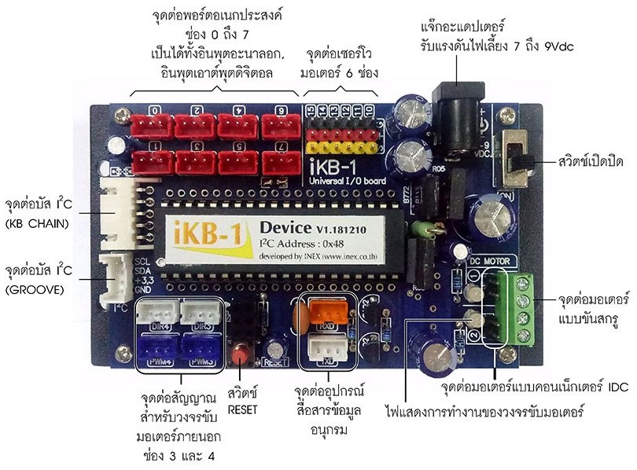

# iKB
  ใช้สำหรับภาษา microPython (iKB)[https://inex.co.th/shop/ikb-1-board.html] <br>
    
### เริ่มต้น
  * แบบระบุขา i2c
  ```blocks
  from machine import I2C,Pin                       #ผนวกชุดคำสั่งควบคุมการทำงานของ I2C และ Pin
  import ikb                                        #ผนวกชุดคำสั่งจากไลบรารี ikb  	
  i2c = I2C(scl = Pin(22),sda=Pin(21),freq=1000000) #ระบุขาของ I2C  
  k = ikb.IKB(i2c)                                  #สร้างตัวแปรมารองรับ   
  k.begin()                                         #เริ่มต้นใช้งาน ikb
 ```
 * แบบไม่ระบุขา i2c
  ```blocks
  from machine import I2C,Pin                       #ผนวกชุดคำสั่งควบคุมการทำงานของ I2C และ Pin
  import ikb                                        #ผนวกชุดคำสั่งจากไลบรารี ikb  	 
  k = ikb.IKB()                                     #สร้างตัวแปรมารองรับ
  k.begin()                                         #เริ่มต้นใช้งาน ikb
 ```
## คำสั่งใช้งานเอาต์พุตจากพอร์ตหมายเลข 0
```blocks
k.output(0,1) 		
```
## อ่านค่าอินพุต จากพอร์ตหมายเลข 0
```blocks
x = k.input(0)  #คืนค่า 0,1 
```
## คำสั่งใช้งานอ่านค่าแอนาลอกจากพอร์ตหมายเลข 2 
```blocks
an = k.analog(2)  #คืนค่า 0-1023    
```
## ตัวอย่าง คำสั่งมอเตอร์

```blocks
k.servo(15,90)  #คำสั่งควบคุมเซอร์โวมอเตอร์พอร์ต 15 ให้หมุนไปที่มุม 90 องศา	
k.motor(1,100)  #คำสั่งควบคุมมอเตอร์ช่อง 1 ให้ตรงขั้วมอเตอร์ความเร็ว 100 %
k.motor(2,-100) #คำสั่งควบคุมมอเตอร์ช่อง 2 ให้กลับขั้วมอเตอร์ความเร็ว 100 %                                          
k.fd(100)       #เดินหน้า 100 %	 
k.bk(80)        #ถอยหลัง 80 %	  
k.sl(60)        #หมุนซ้าย 60 %
k.sr(40)        #หมุนขวา 40 %	    
k.tl(60)        #เลี้ยวซ้าย 60 %	 
k.tr(60)        #เลี้ยวขวา 60 %  
k.fd2(100,50)   #เดินหน้าแบบปรับความเร็วแต่ละมอเตอร์ 1 = 100 % มอเตอร์ 2 = 50 %
k.bk2(55,50)    #ถอยหลังแบบปรับความเร็วแต่ละมอเตอร์ 1 =  55 % มอเตอร์ 2 = 50 %  
k.stop()        #หยุดเคลื่อนที่
 ```                                      
